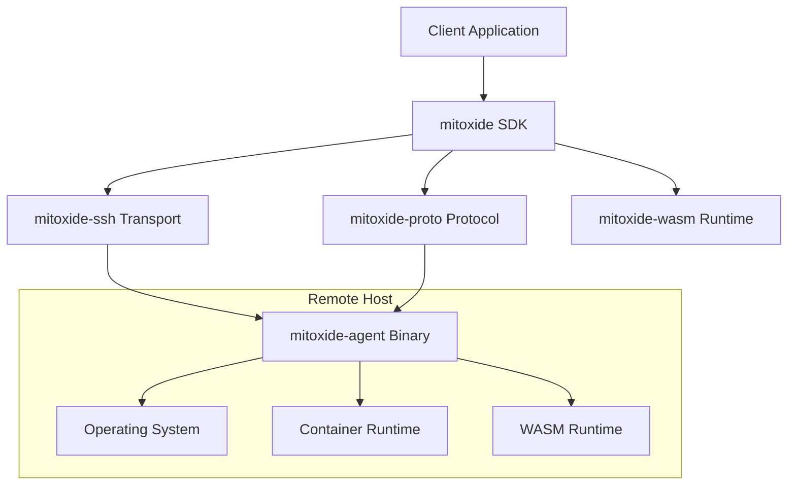
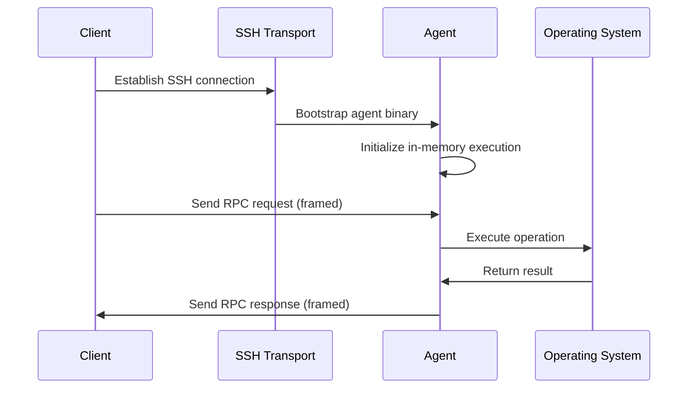

# Design Document

## Overview

Mitoxide is designed as a multi-crate Rust workspace that implements a distributed execution system inspired by Mitogen. The architecture follows a client-agent model where a client library establishes SSH connections to remote hosts, bootstraps lightweight agents, and communicates via a multiplexed binary RPC protocol. The system emphasizes security, performance, and developer ergonomics while supporting advanced features like WASM payload execution and privilege escalation.

## Architecture

### High-Level Architecture



### Component Architecture

The system is organized into five main crates:

1. **mitoxide** - Public SDK and client library
2. **mitoxide-agent** - Remote agent binary
3. **mitoxide-proto** - Protocol definitions and codec
4. **mitoxide-ssh** - SSH transport layer
5. **mitoxide-wasm** - WASM execution runtime

### Protocol Flow



## Components and Interfaces

### mitoxide (SDK Crate)

**Core Types:**
- `Session` - Manages SSH connections and agent lifecycle
- `Context` - Represents execution context on remote host
- `Router` - Handles connection routing and multiplexing
- `MitoxideError` - Comprehensive error taxonomy

**Public API:**
```rust
pub struct Session {
    transport: Box<dyn Transport>,
    router: Router,
}

impl Session {
    pub async fn ssh(target: &str) -> Result<SessionBuilder>;
    pub async fn connect(self) -> Result<ConnectedSession>;
}

pub struct Context {
    session_id: SessionId,
    router: Arc<Router>,
}

impl Context {
    pub async fn proc_exec(&self, cmd: &[&str]) -> Result<ProcessOutput>;
    pub async fn put(&self, local: &Path, remote: &Path) -> Result<()>;
    pub async fn get(&self, remote: &Path, local: &Path) -> Result<()>;
    pub async fn call_wasm<T, R>(&self, module: &WasmModule, input: &T) -> Result<R>;
    pub async fn become(&self, privilege: Privilege) -> Result<Context>;
}
```

### mitoxide-proto (Protocol Crate)

**Frame Structure:**
```rust
#[derive(Debug, Clone, Serialize, Deserialize)]
pub struct Frame {
    pub stream_id: u32,
    pub sequence: u32,
    pub flags: FrameFlags,
    pub payload: Bytes,
}

#[derive(Debug, Clone, Serialize, Deserialize)]
pub enum Message {
    Request(Request),
    Response(Response),
    Stream(StreamData),
    Control(ControlMessage),
}
```

**Wire Protocol:**
- Header: `[stream_id: u32][length: u32][flags: u8][reserved: u8][sequence: u16]`
- Payload: MessagePack-encoded message data
- Flow Control: Credit-based system with window management

### mitoxide-agent (Agent Binary)

**Core Components:**
- `AgentLoop` - Main event loop processing stdin frames
- `Handlers` - Operation handlers for different request types
- `Router` - Local routing for multiplexed streams
- `Bootstrap` - Self-initialization and platform detection

**Handler Interface:**
```rust
#[async_trait]
pub trait Handler: Send + Sync {
    async fn handle(&self, request: Request) -> Result<Response>;
}

pub struct ProcessHandler;
pub struct FileHandler;
pub struct WasmHandler;
pub struct PrivilegeHandler;
```

### mitoxide-ssh (Transport Crate)

**Transport Abstraction:**
```rust
#[async_trait]
pub trait Transport: Send + Sync {
    async fn connect(&mut self) -> Result<Connection>;
    async fn bootstrap_agent(&mut self, agent_binary: &[u8]) -> Result<()>;
}

pub struct StdioTransport {
    ssh_command: Command,
    process: Option<Child>,
}
```

**Bootstrap Strategy:**
1. Detect remote platform (uname -m, uname -s)
2. Select appropriate agent binary variant
3. Transfer agent binary via SSH
4. Execute using memfd_create (Linux) or /tmp fallback
5. Establish framed communication over stdio

### mitoxide-wasm (WASM Runtime Crate)

**WASM Integration:**
```rust
pub struct WasmModule {
    bytes: Vec<u8>,
    metadata: ModuleMetadata,
}

pub struct WasmRuntime {
    engine: wasmtime::Engine,
    store: wasmtime::Store<WasmContext>,
}

impl WasmRuntime {
    pub async fn execute<T, R>(&mut self, module: &WasmModule, input: &T) -> Result<R>
    where
        T: Serialize,
        R: DeserializeOwned;
}
```

## Data Models

### Session Management

```rust
#[derive(Debug, Clone)]
pub struct SessionConfig {
    pub ssh_options: SshOptions,
    pub agent_config: AgentConfig,
    pub timeout: Duration,
    pub max_streams: u32,
}

#[derive(Debug)]
pub struct SessionState {
    pub id: SessionId,
    pub target: String,
    pub status: SessionStatus,
    pub agent_version: Option<String>,
    pub capabilities: Vec<Capability>,
}
```

### Request/Response Types

```rust
#[derive(Debug, Serialize, Deserialize)]
pub enum Request {
    ProcessExec {
        command: Vec<String>,
        env: HashMap<String, String>,
        cwd: Option<PathBuf>,
        stdin: Option<Bytes>,
    },
    FileGet {
        path: PathBuf,
        offset: Option<u64>,
        length: Option<u64>,
    },
    FilePut {
        path: PathBuf,
        data: Bytes,
        mode: Option<u32>,
    },
    WasmExecute {
        module_hash: String,
        input: Bytes,
    },
    PrivilegeEscalate {
        method: PrivilegeMethod,
        credentials: Option<Credentials>,
    },
}

#[derive(Debug, Serialize, Deserialize)]
pub enum Response {
    ProcessResult {
        exit_code: i32,
        stdout: Bytes,
        stderr: Bytes,
    },
    FileData {
        data: Bytes,
        metadata: FileMetadata,
    },
    WasmResult {
        output: Bytes,
    },
    Error {
        code: ErrorCode,
        message: String,
        details: Option<ErrorDetails>,
    },
}
```

### Error Taxonomy

```rust
#[derive(Debug, thiserror::Error)]
pub enum MitoxideError {
    #[error("Transport error: {0}")]
    Transport(#[from] TransportError),
    
    #[error("Protocol error: {0}")]
    Protocol(#[from] ProtocolError),
    
    #[error("Agent error: {0}")]
    Agent(#[from] AgentError),
    
    #[error("WASM execution error: {0}")]
    Wasm(#[from] WasmError),
    
    #[error("Authentication error: {0}")]
    Auth(String),
    
    #[error("Timeout after {duration:?}")]
    Timeout { duration: Duration },
}
```

## Error Handling

### Error Propagation Strategy

1. **Library Errors**: Use `thiserror` for structured error types with context
2. **Binary Errors**: Use `anyhow` for application-level error handling
3. **Network Errors**: Implement retry logic with exponential backoff
4. **Protocol Errors**: Include error codes for programmatic handling
5. **Agent Errors**: Provide detailed error context from remote operations

### Error Recovery

- **Connection Loss**: Automatic reconnection with session restoration
- **Agent Crash**: Re-bootstrap agent and restore context
- **Protocol Mismatch**: Version negotiation and compatibility checking
- **Resource Exhaustion**: Graceful degradation and back-pressure

## Testing Strategy

### Unit Testing

**Protocol Layer:**
- Frame codec serialization/deserialization
- Message routing and multiplexing
- Flow control and back-pressure mechanisms
- Error handling and recovery paths

**Transport Layer:**
- SSH command execution and process management
- Agent bootstrap sequence
- Connection lifecycle management

**WASM Runtime:**
- Module loading and validation
- Execution sandboxing
- Input/output serialization

### Integration Testing

**Docker Test Environment:**
```yaml
# docker-compose.yml structure
services:
  alpine_ro:
    image: alpine:latest
    read_only: true
    tmpfs:
      - /tmp:size=64m
    mem_limit: 64m
    
  ubuntu_min:
    image: ubuntu:22.04
    
  bastion:
    image: ubuntu:22.04
    networks:
      - frontend
      - backend
```

**Test Scenarios:**
1. **Bootstrap Testing**: Verify memfd_create and /tmp fallback
2. **Process Execution**: Large I/O, environment variables, binary data
3. **WASM Execution**: JSON round-trip, error handling
4. **Privilege Escalation**: PTY detection, sudo prompts
5. **Jump Host Routing**: Multi-hop connections
6. **Failure Scenarios**: Network drops, protocol violations

### Property-Based Testing

Using `proptest` for:
- Frame codec round-trip properties
- Message serialization invariants
- Flow control state transitions
- Error handling completeness

### Performance Testing

**Benchmarks with Criterion:**
- RPC latency (p50, p95, p99)
- Throughput under load
- Memory usage patterns
- Connection establishment time

## Security Considerations

### Agent Security

1. **In-Memory Execution**: Prefer memfd_create to avoid disk writes
2. **Binary Verification**: Optional hash/signature checking
3. **Minimal Privileges**: Run with least required permissions
4. **Self-Deletion**: Remove temporary files after execution

### Communication Security

1. **SSH Transport**: Leverage SSH's encryption and authentication
2. **No Network Listeners**: Stdio-only communication
3. **Input Validation**: Strict validation of all incoming data
4. **Resource Limits**: Prevent resource exhaustion attacks

### WASM Sandboxing

1. **WASI Restrictions**: Limited filesystem and network access
2. **Resource Limits**: CPU and memory constraints
3. **Capability-Based Security**: Explicit permission model

## Performance Optimizations

### Protocol Efficiency

1. **Binary Serialization**: MessagePack for compact encoding
2. **Stream Multiplexing**: Reduce connection overhead
3. **Flow Control**: Prevent buffer bloat and memory pressure
4. **Compression**: Optional payload compression for large data

### Agent Optimization

1. **Static Linking**: Minimize dependencies and startup time
2. **Memory Mapping**: Efficient file operations
3. **Async I/O**: Non-blocking operations throughout
4. **Connection Pooling**: Reuse connections when possible

### Caching Strategy

1. **Agent Binaries**: Cache compiled agents by platform
2. **WASM Modules**: Cache compiled modules by hash
3. **SSH Connections**: Connection pooling and reuse
4. **Metadata**: Cache file metadata and directory listings

## Deployment and Operations

### Build Configuration

```toml
# Cargo.toml workspace configuration
[workspace]
members = [
    "crates/mitoxide",
    "crates/mitoxide-agent", 
    "crates/mitoxide-proto",
    "crates/mitoxide-ssh",
    "crates/mitoxide-wasm"
]

[workspace.dependencies]
tokio = { version = "1.0", features = ["full"] }
serde = { version = "1.0", features = ["derive"] }
rmp-serde = "1.1"
thiserror = "1.0"
tracing = "0.1"
```

### Feature Flags

- `ssh2`: Use libssh2 for SSH transport
- `openssh`: Use OpenSSH client for transport  
- `wasm`: Enable WASM runtime support
- `sudo`: Enable privilege escalation
- `docker`: Enable container execution
- `k8s`: Enable Kubernetes integration

### Monitoring and Observability

1. **Structured Logging**: JSON logs with tracing
2. **Metrics**: Connection counts, latency, throughput
3. **Health Checks**: Agent liveness and capability reporting
4. **Debugging**: Detailed protocol tracing in debug builds